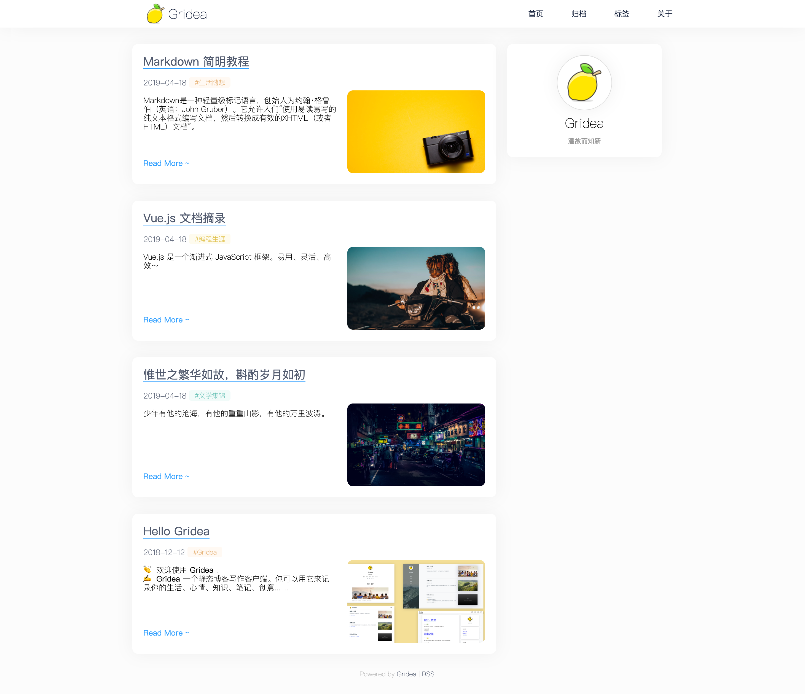
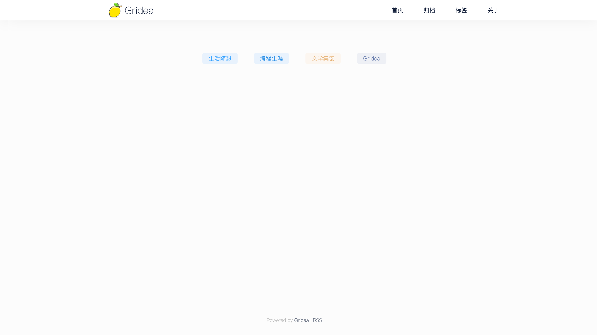
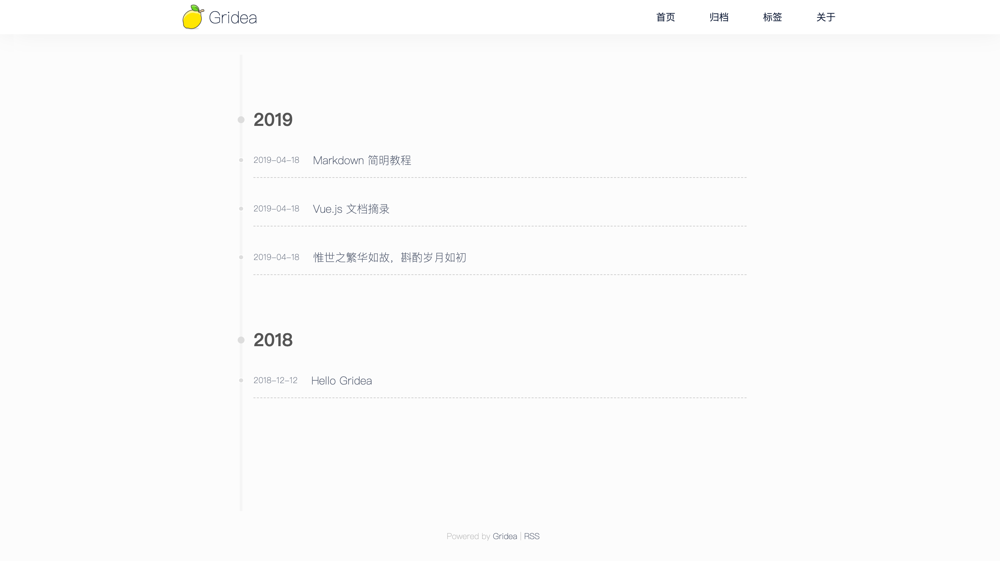

# Gridea 主题 Lemon

## 主题截图

 
首页

  
 
内容页

  
 
标签页

  
 
归档页

  

## 安装

推荐使用 `git clone` 的方式下载到 Gridea 客户端的 theme 目录。方便后期更新升级。

- 打开 theme 目录：`~/Documents/gridea/themes`
- 在当前目录执行 `https://github.com/Mrcxt/gridea-theme-lemon.git`
- 重启 Gridea 客户端查看效果