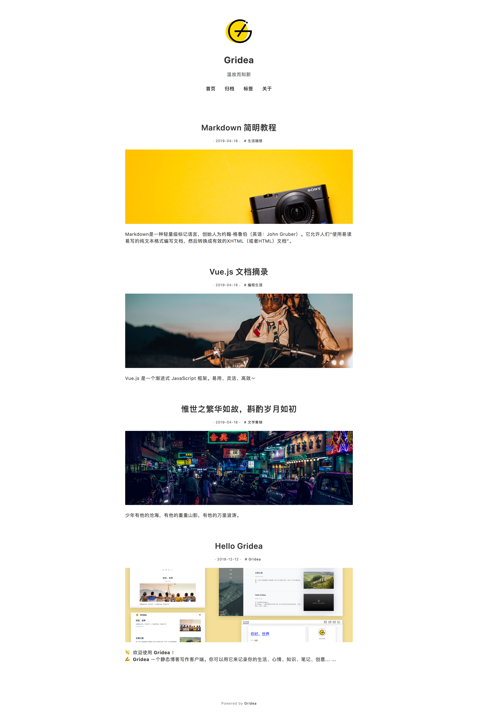

# Gridea 主题 Notes

一款简洁的 Gridea 主题，聚焦内容

  

**项目各文件夹内已写 README，开发主题前敬请阅读！**

`/assets`、`/templates` 必须，Gridea 使用主题时必须文件夹  
`config.json` 可选，主题信息和自定义配置字段信息  
`style-override.js` 可选，根据自定义配置信息生成 css 方法文件  
`/images` 文件夹仅为预览渲染 avatar 所用  

Mock 数据来源：https://github.com/getgridea/mock-json

Gridea 主题开发支持 less，若不熟悉 less 语法，尽可使用 css 语法编写，只不过文件名需要保持 `main.less`

网页链接仅为预览效果所用

主题开发文档：https://gridea.dev/docs/theme.html

欢迎开发 Gridea 主题！

😘 Enjoy~
